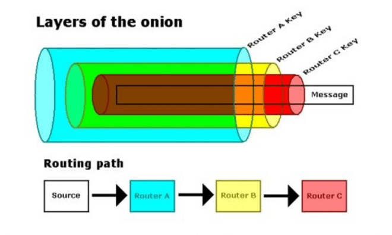

---
[IFLA Statement on Privacy (2015)](https://www.ifla.org/publications/ifla-statement-on-privacy-in-the-library-environment/)

*Data protection and privacy protection should be included as a part of the media and information literacy training for library and information service users. This should include training on tools to use to protect their privacy*

Autorisation du RSSI de l'Univ Rennes pour Tor, pas pour OnionShare

---

--

---
Cas 1: Et si Z-library était demain censuré par nos FAI ?

http://fr.zlibrary24tuxziyiyfr7zd46ytefdqbqd2axkmxm4o5374ptpc52fad.onion/

---
Cas 2: Je vis en Russie, comment consulter la BBC

https://www.bbc.com/news/topics/ce1qrvlegnyt

--

--

--

---

$\newline$
# bibliographie
$\newline$

